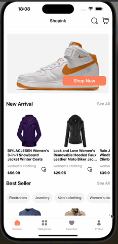
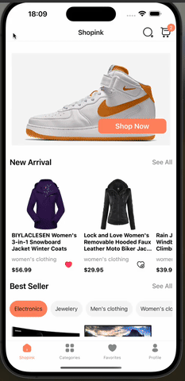

<h1>E-Commerce App</h1>

This project is an e-commerce mobile application developed using React Native, leveraging various libraries and tools to provide a seamless shopping experience. The app aims to offer essential e-commerce functionalities such as browsing products, adding them to the cart, and completing purchases. It emphasizes performance, user experience, and modularity to ensure a smooth and efficient shopping journey for users.

<h2>Used technologies</h2>

<ul>
    <li>**React Native**: Utilized to build a cross-platform mobile application with native-like performance.</li>
    <li>**Context API**: Employed for state management, ensuring efficient and predictable handling of application state.</li>
    <li>**Axios**: Used for making HTTP requests to interact with backend services and retrieve product data.</li>
    <li>**React Navigation**: Integrated for smooth navigation between different screens and sections of the app.</li>
    <li>**UI Kitten**: Leveraged for designing a visually appealing and consistent user interface with ready-to-use UI components.</li>
</ul>

<h2>Features</h2>

<ul>
    <li>**Product Search**: Implemented search functionality to allow users to find specific products easily.</li>
    <li>**User Authentication**: Incorporated user authentication using a secure authentication mechanism.</li>
    <li>**Cart Management**: Enabled users to add products to their cart, view the cart contents, and proceed to checkout.</li>
    <li>**Product Details**: Provided detailed information about each product, including images, descriptions, and prices.</li>
    <li>**Responsive Design**: Ensured compatibility across various screen sizes and orientations for a seamless user experience.</li>
</ul>

<h2>Screen Gif</h2>

 
